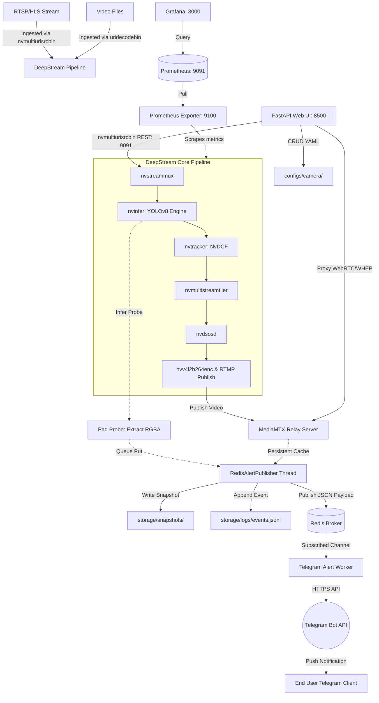
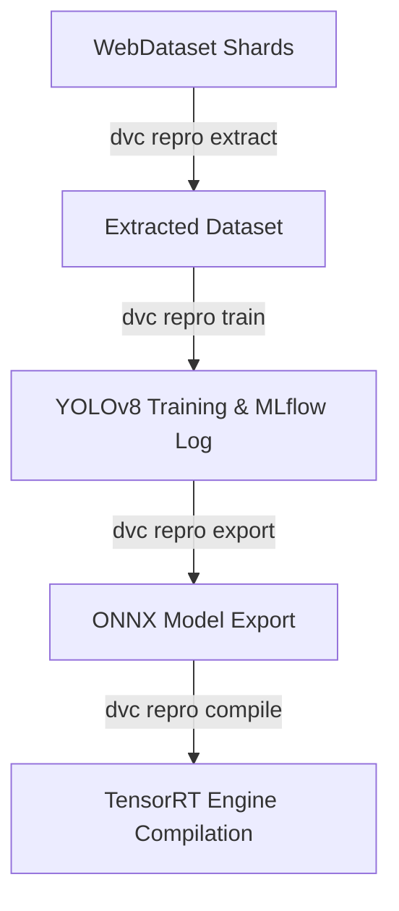

# UIT-MedSeg MLOps — Helmet Violation Detection

> **UIT-MedSeg MLOps** — Real-time helmet violation detection for motorcycles, powered by NVIDIA DeepStream 6.4 and YOLOv8.
>
> Vietnamese: **Hệ thống MLOps phát hiện vi phạm không đội mũ bảo hiểm** — được phát triển bởi UIT MMLab.

[](https://github.com)
[](https://www.python.org/)
[](https://developer.nvidia.com/deepstream-sdk)
[](LICENSE)

---

## Table of Contents

1. [Overview](#overview)
2. [Architecture & Data Flow](#architecture--data-flow)
3. [Quick Start](#quick-start)
4. [Project Structure](#project-structure)
5. [Configuration Guide](#configuration-guide)
6. [Output Format — events.jsonl](#output-format--eventsjsonl)
7. [RTMP & HLS/WebRTC Streaming](#rtmp--hlswebrtc-streaming)
8. [Docker Deployment](#docker-deployment)
9. [MLOps Pipeline & Model Lifecycle](#mlops-pipeline--model-lifecycle)
10. [Development & Testing](#development--testing)
11. [Authors & License](#authors--license)

---

## Overview

UIT-MedSeg MLOps is a production-ready, GPU-accelerated video analytics pipeline that:
- Ingests **live streams** (HLS, RTSP) or **video files** (MP4).
- Runs **real-time object detection** using a custom YOLOv8 Helmet model via DeepStream 6.4.
- Tracks **motorcycles and riders** across frames with the GPU-accelerated NvDCF multi-object tracker.
- Classifies safety states directly as `helmet` (Safe_Motorcycle = index 0) or `no_helmet` (Violation_Motorcycle = index 1).
- Captures annotated **snapshot images** of violations in real-time.
- Publishes structured alerts asynchronously to a **Redis message broker**.
- Dispatches **near-instant Telegram notifications** with the violation snapshot.
- Exposes a central **FastAPI control plane dashboard** for zero-downtime camera management and WHEP stream proxying.
- Provides containerized **monitoring dashboards** with Prometheus and Grafana.

### Key Features & Latency Optimizations

| Feature / Component | Detail |
|---|---|
| **Framework** | NVIDIA DeepStream 6.4 + Python 3 (pyds 1.1.10) |
| **Detection Model** | YOLOv8 Helmet model compiled into a FP16 TensorRT engine |
| **Tracking Element** | NvDCF multi-object tracker (GPU-accelerated) |
| **Styling & OSD** | Custom `osd_draw.py` style overlay (helmet: green, no_helmet: red) |
| **Control Plane** | FastAPI (port 8500) for CRUD configurations and HLS/WHEP dashboard |
| **Zero-Downtime Management** | Add/remove/toggle camera inputs on-the-fly using GStreamer `nvmultiurisrcbin` REST API (port 9091) |
| **Telemetry & Metrics** | Prometheus metric exporter (port 9100) scraping pipeline latency and FPS |
| **Redis Broker** | Asynchronous events publication to Redis queue channel (`helmet_violations`) |
| **Text-First Alerting** | Telegram worker sends text alerts first (< 1.5s latency) and uploads photos as a follow-up |
| **Persistent Frame Cache** | Background daemon thread (`PersistentFrameCache`) keeps RTMP feed open to capture snapshots under `<1ms` (for `snapshot_source: rtmp`) |
| **Pre-Tiled Snapshotting** | Pad probe extracts source-specific RGBA frames from pipeline before tiler (for `snapshot_source: probe`) |

---

## Architecture & Data Flow



### Flow Descriptions

1. **Ingestion & AI Inference**: DeepStream ingests streams configured in `app.yaml` or dynamically via the API. The frames pass through the YOLOv8 primary detector (PGIE) and NvDCF tracker.
2. **Alert Triggering**: The `InferProbe` executes safety rules. When it identifies consecutive frames of a rider violating the helmet rule, it marks the event and triggers an alert.
3. **Evidence Extraction**:
   - **Probe Mode**: Captures the raw source frame before the tiler from a GStreamer pad probe (no cropping required).
   - **RTMP Mode**: Captures the frame from the active `MediaMTX` stream cache via a background `PersistentFrameCache` thread (<1ms age).
4. **Publishing**: Bounding boxes are drawn on the image, the event is appended to `events.jsonl`, and the metadata is pushed to the Redis channel `helmet_violations`.
5. **Worker Notification**: The `telegram-worker` picks up the message, immediately sends a text notification to Telegram, and follows up by uploading the snapshot.
6. **Dynamic Control**: The `web-ui` allows users to manage camera configurations on the fly. It updates YAML files in `configs/camera/` and sends REST commands directly to GStreamer (`/stream/add`, `/stream/remove`).

---

## Quick Start

### Prerequisites

- Ubuntu 20.04 / 22.04 LTS
- NVIDIA GPU (Pascal architecture or newer) with NVIDIA Drivers
- Docker + NVIDIA Container Toolkit
- Python 3.8+ (for local host setup)

### Host Dependencies

If you plan to run local python scripts or tests on the host, install the necessary dependencies:

```bash
# Clone the repository
git clone https://github.com/tranminhvu945/CS317_MLOps.git
cd CS317_MLOps

# Install host python dependencies
pip install -r requirements.txt
pip install pyds-1.1.10-py3-none-linux_x86_64.whl
```

### Environment Configuration

Copy the example environment file and fill in your Telegram Bot credentials and chat information:

```bash
# Copy compose env file to target path
cp apps/vision_service/.env.example apps/vision_service/.env
```

Open `apps/vision_service/.env` and edit:
```bash
TELEGRAM_BOT_TOKEN=your_bot_token_here
TELEGRAM_CHAT_ID=your_chat_id_here
```

### Model Compilation

Before starting the pipeline, the YOLOv8 model must be compiled into a TensorRT Engine.

```bash
# Download and register ONNX model from MLflow registry
make export-onnx

# Compile ONNX to TensorRT engine inside the DeepStream container
make build-engine
```

---

## Project Structure

```
CS317_MLOps/
├── .env.example                     # Root environment variable template
├── .gitignore                       # Git ignore rules
├── .vscode/                         # VS Code workspace config
│   ├── launch.json                  # Debug launcher configurations
│   ├── tasks.json                   # Build tasks
│   └── settings.json                # VS Code workspace settings
│
├── apps/
│   ├── vision_service/              # Core DeepStream vision service
│   │   ├── .env.example             # Environment template for Docker Compose
│   │   ├── configs/                 # YAML configuration files
│   │   │   ├── app.yaml             # Main configuration file (pipeline, paths, settings)
│   │   │   ├── infer/               # DeepStream primary GIE config files
│   │   │   │   ├── pgie_yolov8_helmet.txt
│   │   │   │   └── pgie_yolov8_helmet_b3.txt
│   │   │   └── camera/              # Individual camera configuration files
│   │   │       ├── camera.yaml
│   │   │       ├── camera_002.yaml
│   │   │       ├── camera_003.yaml
│   │   │       └── camera_004.yaml
│   │   ├── libs/                    # Custom deepstream C headers/libraries
│   │   ├── models/                  # YOLOv8 ONNX and TensorRT engine files
│   │   │   └── yolov8/
│   │   │       ├── yolov8_helmet.onnx
│   │   │       ├── yolov8_helmet.onnx_b1_gpu0_fp16.engine
│   │   │       └── labels.txt
│   │   ├── src/                     # Vision service source code
│   │   │   ├── main.py              # Application entry point
│   │   │   ├── app.py               # Main application lifecycle manager
│   │   │   ├── settings.py          # Pydantic settings schema loader
│   │   │   ├── logger.py            # Logger initialization
│   │   │   ├── domain/              # Pydantic data schemas
│   │   │   │   └── camera_schema.py # Camera schema validation
│   │   │   ├── pipeline/            # GStreamer pipeline builders & modules
│   │   │   │   ├── builder.py       # Pipeline construction logic
│   │   │   │   ├── source_file.py   # File-based input source
│   │   │   │   ├── source_hls.py    # RTSP/HLS stream input source
│   │   │   │   ├── infer.py         # Primary nvinfer element creation
│   │   │   │   ├── tracker.py       # NvMultiObjectTracker element creation
│   │   │   │   ├── tiler.py         # Multi-stream tiling (nvmultistreamtiler)
│   │   │   │   ├── osd.py           # On-screen display element creation
│   │   │   │   ├── osd_draw.py      # Custom drawing helpers (green/red styling)
│   │   │   │   ├── rtmp_output.py   # RTMP streaming output chain
│   │   │   │   ├── rtsp_output.py   # RTSP streaming output chain
│   │   │   │   ├── bus_handler.py   # GstBus message loop and loop-playback handler
│   │   │   │   └── frame_monitor.py # Ingestion rate monitor
│   │   │   ├── probes/              # GStreamer metadata probes
│   │   │   │   ├── infer_probe.py   # Detection classification, OSD styling, violation detection
│   │   │   │   ├── msg_broker_probe.py # Message broker probe integration
│   │   │   │   ├── runtime_metrics_probe.py # Track FPS, queue levels, and export to Prometheus
│   │   │   │   └── stage_latency_probe.py   # Measure element-to-element latency metrics
│   │   │   └── services/            # Background worker threads
│   │   │       ├── event_publisher.py       # JSONL writer (events.jsonl)
│   │   │       ├── metrics_exporter.py      # Prometheus client exporter port
│   │   │       └── redis_alert_publisher.py # Queue event handler, snapshot extraction, Redis publisher
│   │   └── tests/
│   │       ├── conftest.py          # Pytest conftest fixtures
│   │       └── unit/                # Unit test suites
│   │           ├── test_redis_alert_publisher.py
│   │           ├── test_settings_telegram.py
│   │           └── test_telegram_worker.py
│   │
│   ├── telegram_worker/             # Async Telegram notification service
│   │   ├── Dockerfile               # Production image for Telegram worker
│   │   ├── main.py                  # Redis subscriber & Telegram API dispatcher
│   │   └── requirements.txt         # Pip packages for worker
│   │
│   └── web_ui/                      # Control plane dashboard
│       ├── app.py                   # Central FastAPI web application
│       ├── camera_config.py         # YAML camera config reader/writer
│       └── static/                  # HTML/JS dashboard interface (index.html, etc.)
│
├── storage/                         # Generated outputs (ignored by Git)
│   ├── logs/
│   │   └── events.jsonl             # Local structured JSONL logs
│   ├── snapshots/                   # JPEG snapshots of violations
│   └── rolling/                     # Metrics rolling files
│
├── monitoring/                      # Telemetry dashboards configuration
│   ├── prometheus/                  # Prometheus scraping configuration
│   └── grafana/                     # Grafana dashboards & datasources
│
├── Dockerfile.ds64_glib             # Main container configuration for DeepStream
├── Dockerfile.mlflow                # Container configuration for MLflow server
├── docker-compose.yml               # Complete system service definitions
├── Makefile                         # Unified command interface
├── dvc.yaml                         # DVC pipeline stages
├── dvc.lock                         # Locked version inputs/outputs
├── params.yaml                      # Model training & deployment hyperparameters
├── requirements.txt                 # Host Python package dependencies
├── scripts/                         # Development & pipeline scripting
│   ├── build_engine.sh              # TensorRT compiler script
│   ├── export_onnx.py               # MLflow registry ONNX model exporter
│   ├── pack_shards.py               # WebDataset shard packer
│   └── extract_shards.py            # WebDataset shard extractor
└── README.md                        # Project documentation (this file)
```

---

## Configuration Guide

The primary configuration of the DeepStream pipeline is managed via `apps/vision_service/configs/app.yaml`. Camera feeds are managed separately in `apps/vision_service/configs/camera/*.yaml`.

### General Configuration Parameters (`app.yaml`)

| Section | Parameter | Type | Description |
|---|---|---|---|
| **app** | `gpu_id` | Integer | GPU Index to use (default: `0`) |
| | `log_level` | String | Logging level (`DEBUG`, `INFO`, `WARNING`, `ERROR`) |
| **storage** | `logs_dir` | String | Target directory to write local logs |
| **events** | `output_file` | String | Absolute or relative path to append JSONL event logs |
| **streams** | `scan_camera_dir` | String | Path to search for individual camera YAML config files |
| **pipeline** | `streammux_width` | Integer | Resolution width for the stream multiplexer |
| | `streammux_height` | Integer | Resolution height for the stream multiplexer |
| | `max_sources` | Integer | Maximum concurrent camera inputs allowed in the pipeline |
| | `sink` | String | Active GStreamer output sink (`fake`, `display`, `rtsp`, `rtmp`) |
| **tiler** | `enabled` | Boolean | Whether to tile multiple feeds into a grid layout |
| | `width` / `height` | Integer | Resolution grid boundaries of the tiled window |
| **infer** | `config_file` | String | Path to the nvinfer PGIE config file |
| | `summary_interval_sec`| Float | Interval to output window detection stats |
| **visualization** | `display_text` | Boolean | Toggle text label overlays on the screen output |
| | `display_bbox` | Boolean | Toggle bounding box drawings on the screen output |
| **rtmp** | `enabled` | Boolean | Toggle RTMP publishing output |
| | `location` | String | RTMP server URL (e.g. `rtmp://mediamtx:1935/vision1`) |
| **tracker** | `enabled` | Boolean | Toggle NvMultiObjectTracker component |
| | `ll_config_file` | String | Config file path for the tracker |
| **metrics** | `enabled` | Boolean | Expose pipeline status over Prometheus |
| | `port` | Integer | HTTP port for Prometheus scrape endpoint |
| **telegram** | `enabled` | Boolean | Toggle alerts publishing to Redis queue |
| | `snapshot_source` | String | Snapshot source (`probe` for GStreamer pad, `rtmp` for MediaMTX cache) |
| | `cooldown_sec` | Float | Delay in seconds between notifications per camera to avoid spam |
| | `min_consecutive_no_helmet_frames` | Integer | Required consecutive violation detections before alerting |

### Camera Ingestion Configuration (`camera/*.yaml`)

Each camera input is configured as follows:

```yaml
camera_id: cam_001
name: cong_1
enabled: true

stream:
  type: hls                 # Ingestion stream type: hls, rtsp, or file
  uri: "http://mediamtx:8888/cam01/index.m3u8"
  reconnect_interval_sec: 10
  timeout_sec: 15
  decoder_drop_frame_interval: 0

detection:
  min_confidence: 0.5
  roi:
    enabled: false          # Set to true to filter violations outside a polygon region
    polygon:
      - [40, 120]
      - [400, 100]
      - [500, 300]
      - [40, 550]
```

---

## Output Format — events.jsonl

Every violation trigger is saved on the host filesystem under `storage/logs/events.jsonl`. Each entry represents a line-separated JSON document:

```json
{
  "event_type": "helmet_violation",
  "timestamp": "2026-05-25T08:46:12.123456+00:00",
  "payload": {
    "event_id": "violation_cong_1_track:102_1716301234000",
    "camera_id": "cong_1",
    "track_id": 102,
    "class_id": 1,
    "class_name": "no_helmet",
    "confidence": 0.892,
    "frame_num": 1420,
    "bbox": [102.5, 245.0, 64.0, 92.5]
  }
}
```

Every interval configured by `infer.summary_interval_sec`, a summary statistic event is logged:

```json
{
  "event_type": "detection_window_summary",
  "timestamp": "2026-05-25T08:46:17.123456+00:00",
  "payload": {
    "window_sec": 5.0,
    "frames": 150,
    "objects": 450,
    "counts_by_label": {
      "helmet #102": 150,
      "no_helmet #103": 89
    },
    "buffer_rate": 30.0,
    "probe_callback_ms": {
      "avg": 0.8124,
      "p95": 1.4502,
      "max": 3.125
    }
  }
}
```

---

## RTMP & HLS/WebRTC Streaming

DeepStream processes video frames, overlays bounding boxes and label metadata, and publishes the combined stream to the `MediaMTX` server via RTMP.

### 1. Ingesting Simulated Feed (Development)

To run without a physical RTSP/HLS camera, run a simulation script that loops an input file to MediaMTX:

```bash
# Start MediaMTX relay server
make mediamtx-up

# Publish 4 simulated feeds (cam01..cam04) in a loop
make publishers-up
```

### 2. Live Stream Formats

The output annotated video can be consumed from MediaMTX in several formats:

- **WebRTC (WHEP)**: `http://localhost:8888/vision1/whep` (used by Web UI player)
- **HLS (HTTP)**: `http://localhost:8888/vision1/index.m3u8`
- **RTSP**: `rtsp://localhost:8554/vision1`
- **RTMP**: `rtmp://localhost:1935/vision1`

---

## Docker Deployment

You can launch the complete development or production stack using Docker Compose.

```bash
# Start the core alert stack (redis, mediamtx, vision-service, telegram-worker)
make stack-up

# Start the Prometheus + Grafana monitoring dashboard stack
make monitoring-up
```

### Viewing Logs

```bash
# Inspect DeepStream pipeline logs
docker compose logs -f vision-service

# Inspect Telegram worker logs
docker compose logs -f telegram-worker
```

### Stop Services

```bash
# Stop core services
make stack-down

# Stop monitoring dashboards
make monitoring-down

# Stop everything
make down
```

### Health & Telemetry Verification

```bash
# Check Web UI status
curl http://localhost:8500/api/health

# Check Prometheus metrics export
curl http://localhost:9105/metrics

# Monitor JSONL events
tail -f storage/logs/events.jsonl
```

---

## MLOps Pipeline & Model Lifecycle

The project utilizes **DVC (Data Version Control)** and **MLflow** to coordinate model training and registration. The pipeline consists of the following automated stages defined in `dvc.yaml`:



### Pipeline Stages

1. **`extract`**: Extracts raw WebDataset `.tar` shards into a standard YOLO training format folder (`dataset/extracted/yolo_helmet_dataset`).
2. **`train`**: Trains the YOLOv8 model based on configurations in `params.yaml`, logs metrics and parameter parameters to MLflow tracking server, and automatically registers the trained weights to MLflow Model Registry with the specified alias (e.g. `Production`).
3. **`export`**: Automatically pulls the designated model version by its alias (e.g. `Production`) from the MLflow registry and converts it into ONNX format, saving it to `apps/vision_service/models/yolov8/yolov8_helmet.onnx`.
4. **`compile`**: Calls `make build-engine` to run the NVIDIA TensorRT builder container to compile the ONNX model into a GPU-specific FP16 TensorRT engine (`yolov8_helmet.onnx_b1_gpu0_fp16.engine`).

### Usage

Run the entire pipeline end-to-end:
```bash
dvc repro
```

Run specific stages:
```bash
# To only extract data
dvc repro extract

# To only train
dvc repro train

# To export the model from MLflow Registry
dvc repro export

# To compile ONNX to TensorRT
dvc repro compile
```

---

## Development & Testing

### Web UI Control Plane

The FastAPI dashboard is located at `apps/web_ui`. It runs independently of the pipeline and communicates with it via REST calls.

To run locally for development:
```bash
uvicorn apps.web_ui.app:app --host 0.0.0.0 --port 8500 --reload
```

Open a web browser and navigate to `http://localhost:8500` to view the stream dashboard and manage active camera configurations.

### Code Formatting

```bash
# Format Python scripts using Black and Isort
make format

# Check formatting compliance without making changes
make lint
```

### Running Tests

Unit test suites for settings, the alert publisher, and the Telegram subscriber are located in `apps/vision_service/tests/`:

```bash
# Run pytest with detailed verbose outputs
make test
```

### Adding a New Rule

1. Edit the core detection loop in `apps/vision_service/src/probes/infer_probe.py` inside `_on_buffer_probe`.
2. Define the classification and condition logic (e.g. tracking thresholds, specific classes, or confidence limits).
3. If a violation is identified, the logic publishes the event using `publisher.publish(...)` and uses `_should_emit_telegram_alert(...)` to dispatch it asynchronously through the `redis_alert_publisher`.

### Adding a New Camera

- **Option 1 (Zero Downtime Web UI)**: Open the Web UI dashboard on port 8500 and use the Camera Management panel to add a camera stream link. It will automatically issue a REST request to DeepStream to add it to the pipeline without stopping the service, and save the camera config to disk.
- **Option 2 (Manual config)**: Create an individual camera YAML file under `apps/vision_service/configs/camera/camera_*.yaml`. The settings loader scans the folder dynamically upon startup.

---

## Authors & License

| | |
|---|---|
| **Project** | UIT-MedSeg MLOps |
| **Organization** | [UIT MMLab](https://mmlab.uit.edu.vn) — University of Information Technology, VNU-HCM |
| **License** | MIT |
| **Contact** | mmlab@uit.edu.vn |

Contributions are welcome! Please open an issue or submit a pull request.

---

*Built with NVIDIA DeepStream 6.4 · GStreamer · Python 3 · Pydantic · FastAPI · DVC · MLflow*
