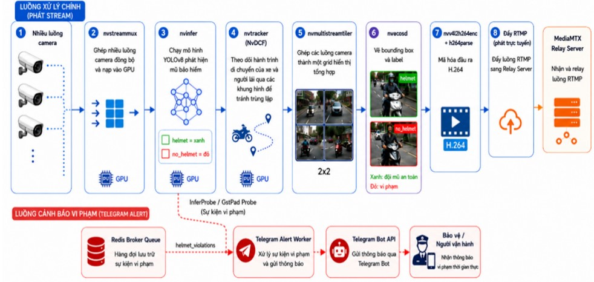
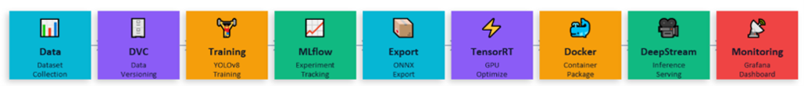
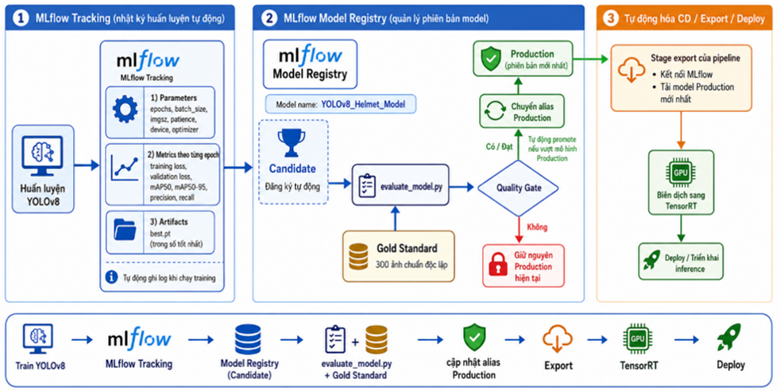

# MLOps — Real-time Helmet Violation Detection

> **MLOps** — Hệ thống MLOps phát hiện vi phạm không đội mũ bảo hiểm theo thời gian thực (Real-time), được thiết kế tối ưu trên nền tảng NVIDIA DeepStream 6.4 và YOLOv8.

[](https://github.com)
[](https://www.python.org/)
[](https://developer.nvidia.com/deepstream-sdk)
[](LICENSE)

---

## 1. Tổng quan (Overview)

Đồ án này xây dựng một hệ thống MLOps hoàn chỉnh nhằm phát hiện người đi xe máy không đội mũ bảo hiểm. Hệ thống không chỉ bao gồm quá trình huấn luyện mô hình (Training Pipeline) mà còn tích hợp toàn diện khâu vận hành, triển khai thực tế (Inference Pipeline) với khả năng xử lý video tốc độ cao.

**Công nghệ lõi:**
- **AI/Computer Vision:** YOLOv8, NVIDIA DeepStream 6.4, TensorRT.
- **MLOps (Training):** DVC (Data Version Control), MLflow (Tracking & Model Registry).
- **Control Plane (Vận hành):** FastAPI, Redis (Message Broker).
- **Observability (Giám sát):** Prometheus, Grafana, Loki, Promtail, Telegram Bot.

---

## 2. Kiến trúc Hệ thống và MLOps Pipeline

### 2.1. Kiến trúc hệ thống


Luồng xử lý chính bắt đầu từ camera hoặc HLS/RTSP stream. Các frame được đưa vào DeepStream, gom batch bằng nvstreammux, chạy qua YOLOv8 (nvinfer) để phát hiện helmet/no_helmet, sau đó chuyển sang NvDCF Tracker để duy trì track ID. Kết quả được vẽ lên video bằng OSD và xuất ra luồng RTMP/HLS thông qua MediaMTX Relay Server.

Song song với luồng video chính là luồng cảnh báo vi phạm. Khi InferProbe phát hiện một track ID vi phạm đủ số frame liên tiếp, hệ thống tạo sự kiện gồm camera ID, thời điểm, track ID, class_name, confidence, bounding box và ảnh snapshot. Sự kiện được ghi lại, đẩy vào Redis và được Telegram worker gửi đến nhóm quản trị.

### 2.2. MLOps Pipeline


Hệ thống quản lý toàn bộ vòng đời của dữ liệu và mô hình AI thông qua quy trình tự động và các công cụ:
- **Data Collection:** Dữ liệu từ Kaggle (~70k ảnh) kết hợp với 1000 mẫu thu thập thực tế tại cổng trường (được gán nhãn bằng CVAT). Trong đó, 300 mẫu thực tế được dùng làm tập **Gold Standard** để kiểm định chất lượng (Quality Gate).
- **DVC (Data Version Control):** Quản lý phiên bản dữ liệu và đóng gói dữ liệu thành WebDataset shards, giúp thuận lợi cho huấn luyện, sao chép và tái lập thí nghiệm.
- **Export & TensorRT:** Sau khi model YOLOv8 đạt tiêu chuẩn, pipeline sẽ tải model Production mới nhất, chuyển đổi sang ONNX và compile thành TensorRT engine (FP16) để tận dụng sức mạnh GPU.
- **DeepStream (Inference Deployment):** Đảm nhiệm việc chạy suy luận (inference) trực tiếp tại hiện trường. Thay vì dùng OpenCV thuần, DeepStream sử dụng GStreamer và các plugin tăng tốc GPU (`nvstreammux`, `nvinfer`, `nvtracker`) để xử lý luồng video trôi chảy, tránh nghẽn frame khi áp dụng cho nhiều camera.
- **Docker & Docker Compose:** Docker hóa toàn bộ môi trường giúp cô lập và tránh xung đột thư viện. Hệ thống sử dụng 2 image riêng biệt (Training Image cho YOLO/MLflow và DeepStream Image cho luồng AI thực tế). Docker Compose đứng ra điều phối vòng đời của các microservices (Redis, MediaMTX, Telegram Worker, Vision Service, API).
- **Monitoring (Giám sát liên tục):** Đóng vai trò then chốt trong vận hành MLOps. Prometheus và Grafana liên tục thu thập số liệu (FPS, Latency, tài nguyên CPU/GPU). Khi thông lượng giảm hoặc phần cứng bị quá nhiệt, hệ thống chẩn đoán sẽ lưu log và phát cảnh báo kịp thời.

### 2.3. Quản lý mô hình với MLflow


MLflow đóng vai trò trung tâm trong việc theo dõi và triển khai mô hình (Tracking & Registry):
- **MLflow Tracking:** Quá trình huấn luyện được thực hiện trong môi trường Docker. Các tham số quan trọng (epoch, batch size, imgsz, optimizer) và các metrics (precision, recall, mAP50) được ghi log chi tiết theo từng epoch. Artifact quan trọng nhất là `best.pt` được lưu vết.
- **MLflow Registry (Quality Gate):** Checkpoint tốt nhất sau khi train được đăng ký với trạng thái **Candidate**. Script `evaluate_model.py` sẽ tự động so sánh Candidate với model **Production** hiện tại trên tập *Gold Standard*. Nếu Candidate đạt chỉ tiêu, nó sẽ được promote lên Production; nếu không đạt, hệ thống tiếp tục giữ model cũ để đảm bảo độ ổn định khi Inference.


---

## 3. Vận hành Thực tế (Observability & Monitoring)

Để đảm bảo hệ thống vận hành trơn tru, một stack giám sát được tích hợp:

### 3.1. Giám sát Hiệu suất (Prometheus & Grafana)
Thông qua Grafana, người quản trị có thể theo dõi thời gian thực (Real-time):
- **Throughput:** FPS đầu vào (Camera), FPS xử lý AI (DeepStream inference), FPS đầu ra.
- **Latency:** Đo lường độ trễ từ lúc camera ghi nhận đến khi có kết quả.
- **System Resource:** Tình trạng CPU, GPU, RAM, VRAM và nhiệt độ để phát hiện tình trạng quá tải.

### 3.2. Cảnh báo Tự động (Grafana Alerting Rules)
Hệ thống sử dụng **Grafana Unified Alerting** để tự động bắn tin nhắn vào Telegram khi có bất thường:
- **Rule CPU/GPU** (ví dụ CPU/GPU > 90%): Gửi cảnh báo hệ thống quá tải.
- **Rule FPS** (ví dụ FPS < 100) : Kích hoạt cảnh báo khẩn cấp khi tốc độ xử lý Pipeline bị suy giảm nghiêm trọng.
- **Cơ chế:** Các luật được thiết lập `Pending -> Firing` trong `30s` để tránh báo động giả, và tự động nhắc nhở (Repeat interval) mỗi 1 phút thông qua tích hợp Telegram Webhook gốc của Grafana.

### 3.3. Thu thập Log Tập trung (Loki & Promtail)
Không cần truy cập SSH hay dùng lệnh `docker logs`, toàn bộ Log của ứng dụng được thu thập theo thời gian thực về Dashboard:
- **Promtail:** Được thiết lập bằng cơ chế `docker_sd_configs` tự động dò quét (Discover) các container đang chạy qua Docker Socket và gắn nhãn (Label) tên container.
- **Loki:** Lưu trữ và chỉ mục hóa toàn bộ luồng Log.
- **Sử dụng:** Trên giao diện Grafana (mục Explore), người dùng chỉ cần nhập LogQL ngắn gọn `{container="uit_medseg_vision"}` để xem hoặc tìm kiếm log của AI Pipeline tức thì.

---

## 4. Giao diện Điều khiển (Web UI & Control Plane API)

Hệ thống tích hợp một Dashboard Web được xây dựng bằng **FastAPI** và **Vanilla JS**, đóng vai trò là Trung tâm điều phối (Serving Orchestrator):

- **Zero-Downtime Scaling:** API `/api/cameras` (POST/PATCH/DELETE) cho phép người dùng thêm luồng camera mới, bật/tắt hoặc xóa camera. API này sẽ chọc thẳng vào luồng xử lý trên GPU của DeepStream để nạp/gỡ luồng video **NGAY LẬP TỨC** mà không cần khởi động lại toàn bộ AI Pipeline.
- **API Proxy (HLS):** Endpoint `/api/hls` xử lý việc bypass CORS để phát mượt mà hàng tá luồng Livestream trực tiếp trên Web Browser.
- **History Tracking:** Giao tiếp với database SQLite (ghi nhận bởi Telegram Worker) để cung cấp API `/api/violations`, hiển thị lịch sử vi phạm không đội mũ (Kèm hình ảnh, thời gian, ID và độ tự tin) lên màn hình Dashboard.

---

## 5. Hướng dẫn cài đặt và chạy Pipeline (How to Run)

### Yêu cầu hệ thống:
- Hệ điều hành: Linux (Ubuntu 20.04/22.04)
- Phần cứng: NVIDIA GPU (RTX 30xx, 40xx hoặc T4/A10)
- Phần mềm: Docker, Docker Compose, NVIDIA Container Toolkit.

### 5.1. Khởi chạy MLOps Training Pipeline
Quá trình xử lý dữ liệu và Retrain (Re-training loop) được tự động hoá qua DVC:
```bash
# Thiết lập môi trường Python
pip install -r requirements.txt

# Khởi chạy Pipeline tự động (Extract -> Train -> Evaluate -> Export -> Compile)
dvc repro
```
*Lưu ý: Bạn có thể theo dõi quá trình huấn luyện trên MLflow UI bằng lệnh `make mlflow-ui`.*

### 5.2. Khởi chạy Inference Pipeline (Triển khai thực tế)
Toàn bộ hệ thống Production (AI Vision, Redis, Telegram Worker, Web UI, Monitoring) được đóng gói chung vào Docker Compose:

```bash
# Terminal 1: Khởi động hệ thống Inference và các service phụ trợ
make run

# Terminal 2: Mở một terminal mới và chạy lệnh sau để khởi động giao diện Web UI
make ui
```

### 5.3. Truy cập các hệ thống
Sau khi khởi động thành công, bạn có thể truy cập các dịch vụ tại:
- **DeepStream REST API:** Port `9091` (Chỉ dùng nội bộ).
- **Prometheus:** Port `9090` (Scrape Endpoint).

- **Web UI Dashboard:** [http://localhost:8500](http://localhost:8500) (Quản lý Camera, xem Livestream, xem lịch sử vi phạm).
- **Grafana Dashboard:** [http://localhost:3005](http://localhost:3005) (Tài khoản mặc định: `admin`/`admin`). Tại đây chứa các bảng điều khiển hiệu suất và cấu hình Loki (LogQL).
- **Xem Video trực tiếp qua VLC:** Mở VLC Media Player, chọn `Media` > `Open Network Stream...` (Phím tắt: `Ctrl + N`) và nhập đường dẫn sau (thay `localhost` bằng IP máy chủ nếu cần):
  - RTMP: `rtmp://localhost:1935/vision1`
---

## 6. Bổ sung cho phần Thực hành 

### 6.1. Tích hợp Grafana Alerts & Telegram Webhook (Lab Monitoring)
Hệ thống giám sát không chỉ dùng để "nhìn", mà có khả năng **chủ động báo động** (Active Alerting):
- Đã thiết lập các Rule cảnh báo bằng **PromQL** thông qua Grafana Unified Alerting (VD: `min(pipeline_infer_fps) < 100`, `system_cpu_utilization_pct > 90`).
- Tích hợp thành công Webhook để bắn tin nhắn thẳng vào Group Telegram.
- **Cấu hình:** Tùy chỉnh `group_wait`, `group_interval` và `repeat_interval: 1m` để đảm bảo cảnh báo được gửi liên tục mỗi phút khi hệ thống có sự cố.

### 6.2. Tích hợp Centralized Logging với Loki & Promtail (Lab Logging)
Đã thay thế hoàn toàn việc đọc log thủ công (bằng lệnh `docker logs`) bằng kiến trúc thu thập Log tập trung chuẩn Enterprise:
- **Promtail:** Được cấu hình tự động dò tìm qua Docker Socket (`docker_sd_configs`), giúp thu gom toàn bộ log của các container đang chạy.
- **Loki & Grafana:** Tích hợp Datasource tự động (Provisioning). Hỗ trợ truy vấn log thời gian thực cực nhanh bằng LogQL trực tiếp trên giao diện web của Grafana (VD: `{container="uit_medseg_vision"}`).

### 6.3. Xây dựng Control Plane API (Lab Model Serving & API)
Thay vì chỉ dựng một FastAPI để dự đoán (predict) một tấm ảnh đơn giản, dự án đã đã bổ sung thêm một số API hỗ trợ khả năng quản lý hệ thống:
- **Serving Orchestrator:** API đóng vai trò là Control Plane, cho phép thêm bớt cấu hình camera ngay trong lúc AI đang chạy (Zero-Downtime Scaling).
- **Swagger UI:** Tích hợp tự động tại đường dẫn **[http://localhost:8500/docs](http://localhost:8500/docs)** để cung cấp tài liệu API trực quan và cho phép test trực tiếp các endpoint (như `/api/cameras`, `/api/violations`).
- **Giao tiếp liên dịch vụ:** Giao tiếp mượt mà với cả AI Engine (DeepStream GPU) và Message Broker (Redis) để quản lý trọn vẹn vòng đời của dữ liệu suy luận.

---

