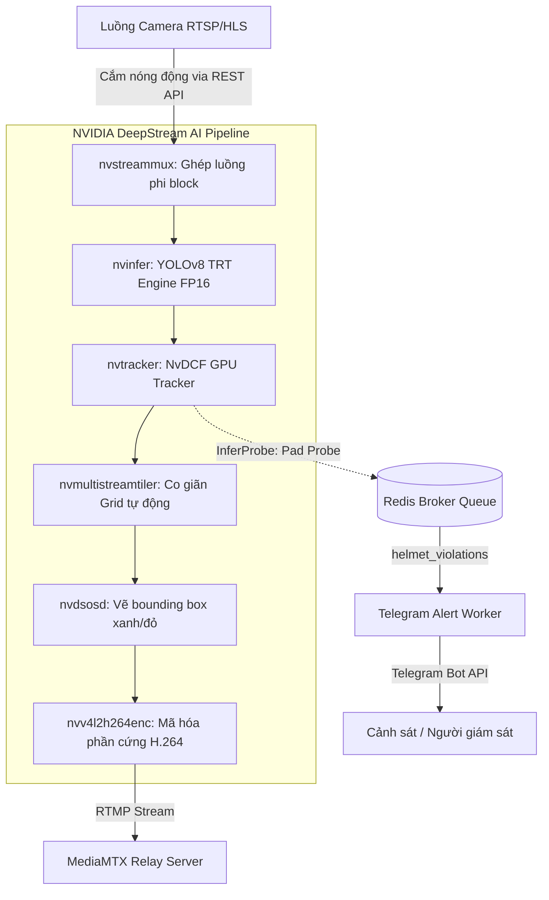
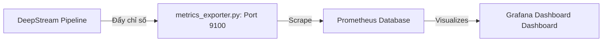

# ĐỀ CƯƠNG SLIDE THUYẾT TRÌNH DỰ ÁN (RÚT GỌN & TẬP TRUNG)
## Dự án: UIT-MedSeg MLOps — Hệ Thống Phát Hiện Vi Phạm Không Đội Mũ Bảo Hiểm

Tài liệu này tổng hợp cô đọng những phần quan trọng, thực tế nhất của dự án và làm rõ vai trò cụ thể của từng công cụ MLOps (**DVC, MLflow, Docker, Prometheus & Grafana Monitor**) được áp dụng thực tế trong mã nguồn của dự án.

---

### SLIDE 1: TIÊU ĐỀ & TỔNG QUAN DỰ ÁN
* **Tiêu đề:** Hệ Thống Phát Hiện Vi Phạm Không Đội Mũ Bảo Hiểm Theo Thời Gian Thực (UIT-MedSeg Helmet Detection Service)
* **Đơn vị phát triển:** UIT MMLab (Phòng thí nghiệm Truyền thông Đa phương tiện - Đại học Công nghệ Thông tin, VNU-HCM).
* **Nhiệm vụ cốt lõi:** 
  * Tiếp nhận đồng thời nhiều luồng camera live (RTSP/HLS) từ thực địa.
  * Phát hiện và theo dõi hành trình người lái xe máy không đội mũ bảo hiểm theo thời gian thực.
  * Chụp ảnh bằng chứng sắc nét gốc (trước khi ghép grid) và tự động gửi cảnh báo ngay lập tức qua Telegram Bot.
  * Xuất dữ liệu telemetry thời gian thực về hiệu năng hệ thống lên dashboard giám sát tập trung.

---

### SLIDE 2: KIẾN TRÚC HỆ THỐNG & AI PIPELINE (CORE ARCHITECTURE)
*(Nên vẽ sơ đồ này lên Slide để thể hiện tính chuyên nghiệp của hệ thống)*

---

### SLIDE 3: BỨC TRANH CÔNG CỤ MLOPS TRONG DỰ ÁN (THE MLOPS TOOLSTACK)
Thay vì lý thuyết suông, mỗi công cụ trong dự án đảm nhận một nhiệm vụ thực tế, gắn chặt với mã nguồn:

| Công cụ MLOps | Vai trò cụ thể trong mã nguồn dự án |
| :--- | :--- |
| **Docker** | Cô lập môi trường huấn luyện và tối ưu hóa chạy DeepStream trên phần cứng GPU NVIDIA đồng bộ. |
| **DVC (Data Version Control)** | Tự động hóa luồng tiền xử lý, đóng gói dữ liệu và định nghĩa pipeline huấn luyện mô hình có tính lặp lại tốt. |
| **MLflow** | Theo dõi thông số huấn luyện (Tracking) và quản lý phiên bản Candidate / Production (Model Registry). |
| **Prometheus & Grafana** | Thu thập chỉ số (metrics) thời gian thực và trực quan hóa toàn bộ sức khỏe hệ thống. |

---

### SLIDE 4: DOCKER & DVC ĐƯỢC SỬ DỤNG NHƯ THẾ NÀO?

#### 1. DOCKER — Cô lập & Tận dụng phần cứng GPU
* **Image Huấn luyện (`mlops_train`):** Đóng gói toàn bộ thư viện `ultralytics` (YOLOv8), `mlflow` và các driver CUDA để chạy huấn luyện GPU đồng bộ trên bất kỳ máy chủ nào mà không bị xung đột thư viện.
* **Image DeepStream (`mlops_thuc`):** Chứa TensorRT, DeepStream 6.4 SDK, driver giải mã video bằng GPU. Chạy dịch vụ `vision-service` xử lý stream thời gian thực mượt mà.
* **Docker Compose:** Quản lý toàn bộ vòng đời của các dịch vụ bổ trợ chạy ngầm: `redis` (hàng đợi cảnh báo), `mediamtx` (relay video stream), `telegram-worker` (gửi tin nhắn) và stack giám sát `prometheus`/`grafana`.

#### 2. DVC (Data Version Control) — Tự động hóa Pipeline & Tối ưu I/O dữ liệu
* **Tự động hóa pipeline (`dvc.yaml`):** Quản lý chuỗi các bước tuần tự: giải nén dataset $\rightarrow$ train model $\rightarrow$ evaluate chất lượng $\rightarrow$ export ONNX $\rightarrow$ biên dịch TensorRT. Khi chạy `dvc repro`, DVC tự động nhận biết file nào thay đổi để chỉ chạy lại các stage cần thiết (Caching).
* **WebDataset Sharding (`pack_yolo_to_shards.py`):** DVC quản lý việc đóng gói hàng ngàn file ảnh/label nhỏ lẻ thành các tệp shard dạng `.tar` lớn đặt tại `dataset/shards/`. 
  * *Tác dụng:* Khi huấn luyện, GPU đọc tuần tự các tệp tar này trực tiếp vào RAM, giảm hàng triệu truy vấn I/O đọc đĩa nhỏ lẻ, triệt tiêu hiện tượng nghẽn cổ chai đọc đĩa (I/O bottleneck), tăng tốc độ train tối đa.

---

### SLIDE 5: MLFLOW ĐƯỢC SỬ DỤNG NHƯ THẾ NÀO?

#### 1. MLflow Tracking — Nhật ký huấn luyện tự động
* Khi chạy tác vụ train YOLOv8, module MLflow tích hợp tự động bắt và gửi các chỉ số thời gian thực lên **MLflow Server (cổng 5001)**:
  * *Parameters:* `epochs`, `batch_size`, `imgsz`, `patience`, `device`, `optimizer`.
  * *Metrics qua từng epoch:* Training loss (box, class, dfl), validation loss, đặc biệt là các metrics chất lượng như `mAP50`, `mAP50-95`, `precision`, `recall`.
  * *Artifacts:* Lưu trữ tệp trọng số mô hình tốt nhất (`best.pt`).

#### 2. MLflow Model Registry — Quản lý phiên bản & Chất lượng (Quality Gate)
* Sau khi train xong, mô hình được tự động đăng ký vào Registry với tên `YOLOv8_Helmet_Model` và gán nhãn ứng viên **Candidate**.
* Script `evaluate_model.py` thực hiện đánh giá Candidate trên tập dữ liệu chuẩn độc lập **Gold Standard** (300 ảnh chuẩn). Nếu Candidate vượt qua mô hình Production hiện tại qua các luật nghiêm ngặt (Recall không giảm, mAP50 không giảm quá dung sai 1%), MLflow Registry sẽ tự động chuyển alias **Production** sang phiên bản mới.
* Tự động hóa CD: Stage `export` của pipeline sẽ chỉ kết nối MLflow tải mô hình Production mới nhất về biên dịch sang TensorRT để deploy nếu Quality Gate thông qua.

---

### SLIDE 6: GRAFANA & PROMETHEUS GIÁM SÁT CÁI GÌ? (TELEMETRY & MONITORING)
* **Luồng hoạt động:** 
  Trong dịch vụ DeepStream, file `metrics_exporter.py` sẽ liên tục thu thập dữ liệu hiệu năng và export ra một endpoint `/metrics` (port 9100). **Prometheus** sẽ tự động cào (scrape) các thông tin này mỗi vài giây, lưu vào cơ sở dữ liệu time-series và đẩy lên dashboard trực quan của **Grafana (port 3005)**.

#### Grafana trực quan hóa và giám sát 5 nhóm chỉ số cốt lõi:
1. **Thông lượng Pipeline (Throughput Metrics):**
   * *FPS đầu vào (`pipeline_input_fps`)*: Tốc độ nhận khung hình thực tế của từng camera.
   * *FPS xử lý AI (`pipeline_infer_fps`)*: Tốc độ xử lý của mô hình YOLOv8 trên GPU.
   * *FPS đầu ra (`pipeline_output_fps`)*: Tốc độ ghi luồng/đẩy RTMP.
2. **Độ trễ hệ thống (Latency Metrics):**
   * *Độ trễ xử lý (`pipeline_latency_ms`)*: Thời gian trung bình từ lúc khung hình đi vào pipeline đến khi hoàn thành inference.
   * *Overhead của Probe (`probe_callback_avg_ms` / `p95`)*: Thời gian chạy của các hàm phân tích Cảnh báo (đảm bảo code python/C++ trong probe không làm nghẽn pipeline).
3. **Mất frame & Bottleneck (Frame Drops & Queue Health):**
   * *Số lượng frame drop (`pipeline_dropped_frames_total`)*: Đo đếm số khung hình bị bỏ qua ở tầng decoder phần cứng (khi kích hoạt drop-frame-interval để giảm tải GPU).
   * *Trạng thái hàng đợi (`pipeline_queue_level`)*: Giám sát dung lượng đệm của các Queue GStreamer (như queue trước OSD, queue trước Encoder) nhằm phát hiện xem stage nào đang bị nghẽn (bottleneck).
4. **Sức khỏe phần cứng (System Resource Telemetry):**
   * *CPU & GPU Utilization (% utilization)*: Hiệu suất sử dụng nhân tính toán.
   * *RAM & VRAM Utilization*: Dung lượng bộ nhớ hệ thống và bộ nhớ card đồ họa đang bị chiếm dụng.
   * *CPU & GPU Temperature ($^\circ$C)*: Nhiệt độ phần cứng để phát hiện tình trạng quá nhiệt khi scale nhiều camera.
5. **Thống kê vi phạm & Trạng thái camera (Detections & Camera Status):**
   * *Camera Active (`camera_active`)*: Trạng thái kết nối của từng camera (1 = Hoạt động mượt mà, 0 = Mất tín hiệu/Chết luồng).
   * *Số ca vi phạm tích lũy (`helmet_violation_total`)*: Tổng số frame bắt lỗi không đội mũ.
   * *Số ca vi phạm ĐỘC NHẤT (`helmet_violation_unique_total`)*: Chỉ số đếm số lượt vi phạm **thực tế** dựa trên Tracking ID (chỉ đếm 1 lần khi 1 chiếc xe máy chạy qua, tránh tình trạng 1 xe máy chạy qua bị đếm trùng lặp hàng chục lần trên các frame khác nhau).

---

### SLIDE 7: CÁC ĐIỂM SÁNG TỐI ƯU HÓA CAMERA NỔI BẬT (Scale & Frame Drops)
*(Phần này giải đáp sâu câu hỏi về tối ưu camera và mất frame của DeepStream)*

* **1. Ghép luồng phi block (Non-blocking nvstreammux):**
  * Cấu hình `sync-inputs=False` và `live-source=1` trên `nvstreammux`. Khi có 1 camera bị mất kết nối mạng hoặc giật lag, pipeline sẽ bỏ qua luồng đó và tiếp tục xử lý các camera còn lại với FPS tối đa, tránh block dây chuyền.
* **2. Bộ chặn lỗi luồng non-fatal (Custom Bus Error Interceptor):**
  * Viết riêng bộ **BusHandler** chặn các lỗi `ERROR` phát ra từ các bin nguồn (`rtspsrc`, `hlsdemux`). Khi lỗi xảy ra, BusHandler chỉ in warning và giữ nguyên main loop hoạt động thay vì làm crash toàn bộ dịch vụ. Camera lỗi sẽ tự động thực hiện reconnect dưới nền.
* **3. Trích xuất ảnh gốc trước Tiler (Pre-Tiled Snapshotting):**
  * Tách một nhánh rẽ **Snapshot Branch** bằng `snapshot_tee` trước khi các luồng video bị ghép grid. Nhánh này chuyển đổi NV12 sang RGBA trên GPU và lấy ảnh thô sắc nét đúng của camera vi phạm, giúp Telegram gửi ảnh bằng chứng chất lượng cao.
* **4. Đọc ảnh siêu tốc từ RAM cache (<1ms) (Persistent Frame Cache):**
  * Thay vì mở kết nối OpenCV mới tốn ~4.5s để lấy ảnh vi phạm, hệ thống duy trì kết nối RTMP liên tục qua thread chạy ngầm, liên tục cache frame mới nhất vào RAM. Khi có sự kiện vi phạm, publisher chỉ mất **< 1ms** để lấy ảnh từ cache RAM ra vẽ bounding box và lưu trữ.
* **5. Hardware Decoder Drop (Bỏ qua giải mã phần cứng):**
  * Cấu hình `drop-frame-interval` trên bộ giải mã NVIDIA (nvdec). Khi GPU quá tải hoặc mạng quá nhiều camera, nvdec tự động giải mã cách quãng (ví dụ giải mã 1 khung hình bỏ qua 1 khung hình), giảm ngay 50% tải tính toán giải mã trên GPU, cứu hệ thống khỏi hiện tượng sụt FPS nghiêm trọng.
